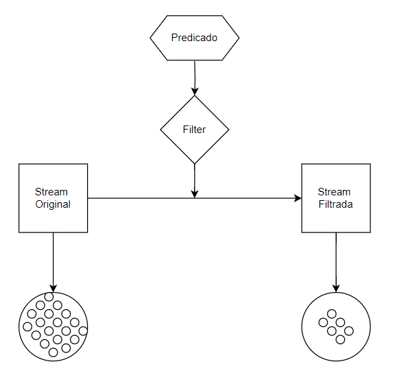

# Filter - [Filtro]

- Definição: 
   - Stream<T> filter(Predicate<? super T> predicate)

- Tipo: 
    - Operação Intermediária

- Descrição: 
    - Retorna um novo fluxo que contém os elementos do fluxo original que atendeu ao predicado fornecido

- Exemplo: 
    ```
    List nomes = Arrays.asList("Programação","Funcional");
    List resultado = names.stream().filter(s->s.startsWith("F"));
    ```
- Diagrama:

    

- Fonte: 
    - https://docs.oracle.com/javase/8/docs/api/java/util/stream/Stream.html
