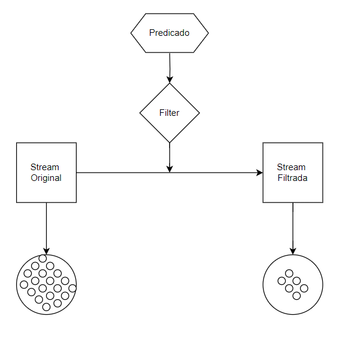

# Map - [Mapa]

- Definição: 
    - <R> Stream<R> map(Function<? super T,? extends R> mapper)

- Parâmetro:
    - Função

- Tipo: 
    - Operação Intermediária

- Descrição: 

- Exemplo: 
    ```
    List nomes = Arrays.asList("Programação","Funcional");
    List resultado = names.stream().filter(s->s.startsWith("F"));
    ```
- Diagrama:

    

- Fonte: 
    - https://docs.oracle.com/javase/8/docs/api/java/util/stream/Stream.html