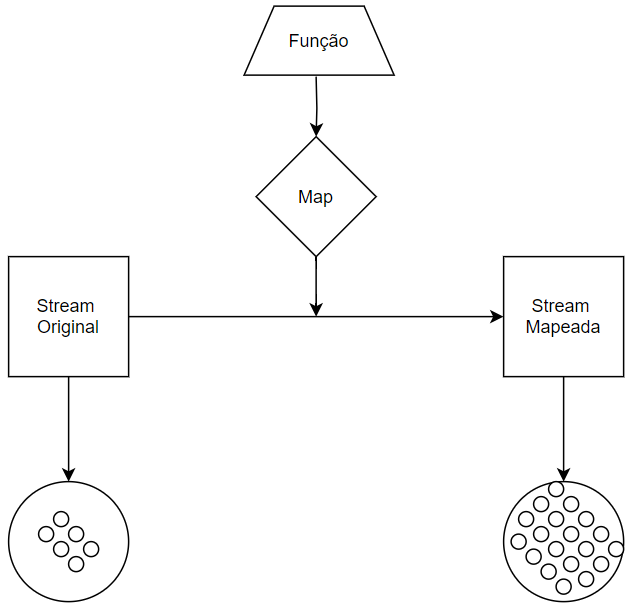

# Map Double - [Mapa Double]

- Definição: 
    - DoubleStream mapToDouble(ToDoubleFunction<? super T> mapper)

- Parâmetro:
    - Função

- Tipo: 
    - Operação Intermediária

- Descrição:
    - 

- Exemplo: 
    ```
 
    ```
- Diagrama:

    

- Fonte: 
    - https://docs.oracle.com/javase/8/docs/api/java/util/stream/Stream.html