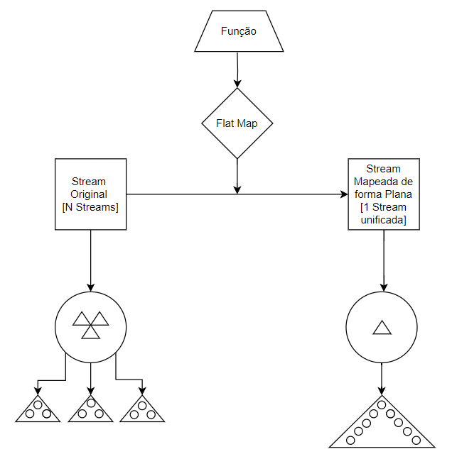

# Flat Map - [Mapa Plano]

- Definição: 
    - IntStream flatMapToInt(Function<? super T,? extends IntStream> mapper)


- Tipo: 
    - Operação Intermediária

- Parâmetro:
    - Função Int

- Retorno:
    - Retorna um fluxo int mapeado de forma plana, ou seja, um fluxo que contém a unificação de vários fluxos que podem ter sido alterados ou não

- Exemplo: 
    ```
	List<List<Integer>> numeros_lista = Arrays.asList(
				Arrays.asList(1, 2, 3),
				Arrays.asList(4, 5, 6),
				Arrays.asList(7, 8, 9)
		);
	List<Integer> numeros_flat_map_int = numeros_lista.stream().flatMapToInt(l -> l.stream().mapToInt(i -> i*i)).boxed().toList();
    ```

- Diagrama:

    

- Fonte: 
    - https://docs.oracle.com/javase/8/docs/api/java/util/stream/Stream.html