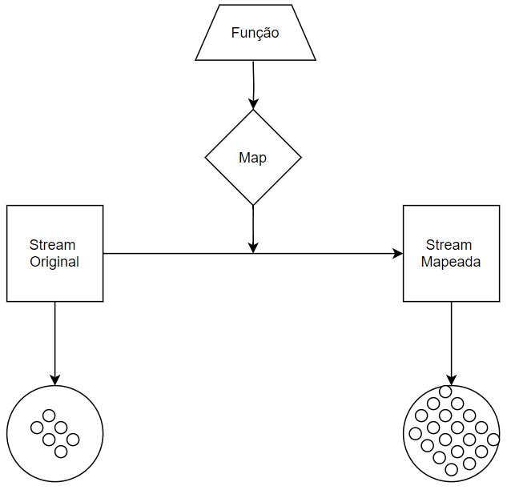

# Flat Map Int - [Mapa Plano Int]

- Definição: 
    - DoubleStream mapToDouble(ToDoubleFunction<? super T> mapper)

- Tipo: 
    - Operação Intermediária

- Parâmetro:
    - Função To Double

- Retorno:
    - Retorna um fluxo double mapeado, ou seja, um fluxo que contém os resultados da aplicação da função to double fornecida no fluxo original 

- Exemplo: 
    ```
    List<String> numeros_string_double = Arrays.asList("1.4", "2.7", "3.2", "4.6");
	List<Double> numeros_double = numeros_string_double.stream().mapToDouble(Double::parseDouble).boxed().toList();
    ```
- Diagrama:

    

- Fonte: 
    - https://docs.oracle.com/javase/8/docs/api/java/util/stream/Stream.html