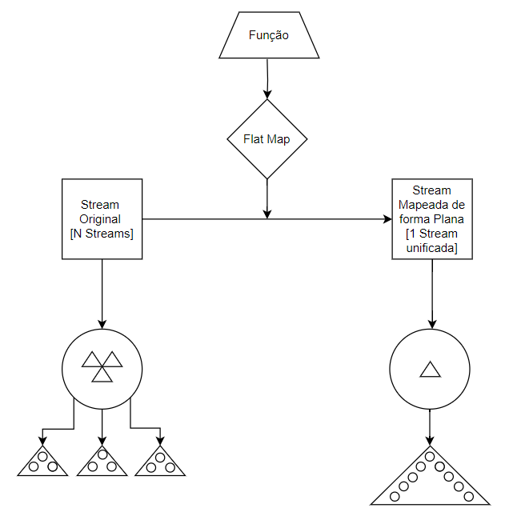

# Flat Map Double - [Mapa Double Plano]

- Definição: 
    - DoubleStream flatMapToDouble(Function<? super T,? extends DoubleStream> mapper)


- Tipo: 
    - Operação Intermediária

- Parâmetro:
    - Função Double

- Retorno:
    - Retorna um fluxo double mapeado de forma plana, ou seja, um fluxo que contém a unificação de vários fluxos que podem ter sido alterados ou não

- Exemplo: 
    ```
	List<List<Double>> numeros_lista_double = Arrays.asList(
				Arrays.asList(1.1, 2.2, 3.3),
				Arrays.asList(4.4, 5.5, 6.6),
				Arrays.asList(7.7, 8.8, 9.9)
		);
	List<Double> numeros_flat_map_double = numeros_lista_double.stream().flatMapToDouble(l -> l.stream().mapToDouble(i -> i*i)).boxed().toList();
    ```

- Diagrama:

    

- Fonte: 
    - https://docs.oracle.com/javase/8/docs/api/java/util/stream/Stream.html